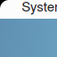

# Menu [](https://cirrus-ci.com/github/helloSystem/Menu) [](https://hosted.weblate.org/engage/hellosystem/)



Global menu bar written in Qt with as few Kf5 dependencies as possible

On FreeBSD:


On FreeBSD-based LIVEstep:


## Dependencies

On Arch Linux:

```
sudo pacman -Sy
sudo pacman -S cmake gcc qt5-base qt5-tools qt5-svg qt5-x11extras kwindowsystem libxtst libxdamage libxcomposite libxrender libxcb xcb-util libdbusmenu-qt5 kdbusaddons libpulse glibc make pkgconf icu
```

__Note__ that not all functionality is implemented for anything else than FreeBSD at this point. So building the Menu for operating systems other than FreeBSD will result in partly non-functional menu, currently only usable for development.

On FreeBSD:

```
sudo pkg install -y cmake pkgconf qt5-x11extras qt5-qmake qt5-widgets qt5-buildtools kf5-kdbusaddons kf5-kwindowsystem libdbusmenu-qt5 qt5-concurrent
```

## Build

```
mkdir build
cd build
cmake ..
make
sudo make install
```
## How to use

### Qt applications (KDEPlasmaPlatformTheme.so and libqgtk3.so work, plain Qt and qt5ct don't work yet)

Currently only works with `QT_QPA_PLATFORMTHEME=kde` and https://github.com/helloSystem/QtPlugin using `QT_QPA_PLATFORMTHEME=panda`. FIXME: Make it work with e.g., `QT_QPA_PLATFORMTHEME=qt5ct`.

For this, it would probably need to support the __Unity protocol__?

### Gtk applications (Inkscape, GIMP, Audacity work; Firefox, Thunderbird do not work yet)

Prerequisite: https://www.freshports.org/x11/gtk-app-menu/

E.g., Firefox and Chrome use

```
/usr/local/lib/gtk-2.0/modules/libappmenu-gtk-module.so
/usr/local/lib/gtk-3.0/modules/libappmenu-gtk-module.so
```

On FreeBSD:

```
git clone https://github.com/NorwegianRockCat/FreeBSD-my-ports
cd FreeBSD-my-ports/
cd x11/gtk-app-menu/
sudo make
sudo make install
```

`gmenudbusmenuproxy` https://phabricator.kde.org/D10461?id=28255

```
user@FreeBSD$ sudo pkg which /usr/local/bin/gmenudbusmenuproxy 
/usr/local/bin/gmenudbusmenuproxy was installed by package plasma5-plasma-workspace-5.19.2
```

Can we get it "standalone", without KDE Plasma?

> This application finds windows using GTK GMenu DBus interfaces [1] and forwards them through DBusMenu. (...) 
> LibreOffice with appmenu-gtk-module (...)
> Works with Gimp or Inkscape if you have appmenu-gtk-module (there's GTK2 and GTK3 variants) installed and GTK_MODULES=appmenu-gtk-module environment variable set.

More information regarding it: https://blog.broulik.de/2018/03/gtk-global-menu/

```
user@FreeBSD$ export GTK_MODULES=appmenu-gtk-module # Not needed!
user@FreeBSD$ ls /usr/local/lib/gtk-3.0/modules/libappmenu-gtk-module.so
# /usr/local/lib/gtk-3.0/modules/libappmenu-gtk-module.so = Needed!
user@FreeBSD$ gmenudbusmenuproxy &
# Now launch inkscape
user@FreeBSD$ inkscape
```

__Initially__ the menu is empty, but when I bring a Qt application to the front and __then__ switch back to the Inkscape window, then the menus __work__.

```
user@FreeBSD$ export GTK_MODULES=appmenu-gtk-module # Not needed!
user@FreeBSD$ ls /usr/local/lib/gtk-3.0/modules/libappmenu-gtk-module.so
# /usr/local/lib/gtk-3.0/modules/libappmenu-gtk-module.so = Needed!
user@FreeBSD$ gmenudbusmenuproxy &
# Now launch gimp
user@FreeBSD$ gimp
```

Same: __Initially__ the menu is empty, but when I bring a Qt application to the front and __then__ switch back to the Inkscape window, then the menus __work__.

Seeing lots of

```
QDBusSignature: invalid signature ""
QDBusSignature: invalid signature ""
QDBusSignature: invalid signature ""
```

in `gmenudbusmenuproxy`.


Same for __Audacity__.

TODO: Can we get it to work for Firefox and Thunderbird? Are they missing this functionality lately?

```
user@FreeBSD$ export GTK_MODULES=appmenu-gtk-module
user@FreeBSD$ gmenudbusmenuproxy &
# Now launch firefox
kde.dbusmenuproxy: Got an empty menu for 0 on ":1.103" at "/org/appmenu/gtk/window/0"
```

Same for Thunderbird. `kde.dbusmenuproxy: Got an empty menu for 0 on ":1.152" at "/org/appmenu/gtk/window/1".


## License

menubar is licensed under GPLv3.


## Also see

https://github.com/cutefishos/statusbar/
